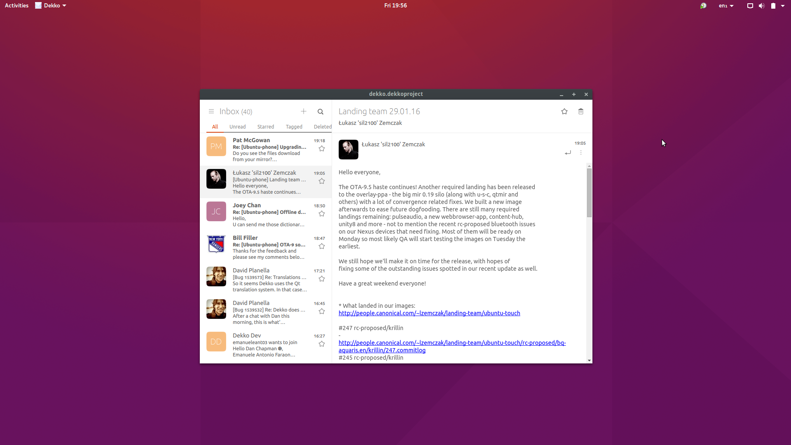

Dekko email client 
=========

This file serves as a development guide to get yourself setup. Familiarising yourself with the projects structure and work flow. The majority of this guide is aimed at new contributors. For seasoned open source developers you are probably familiar with a lot of the concepts outlined here.

Please submit patches to this documentation if something is missing or just leave a comment :-)

Contact
=======

* [Launchpad](https://launchpad.net/dekko)
* [#dekko on freenode](http://webchat.freenode.net/?channels=dekko)
* [Telegram](https://telegram.me/joinchat/AyyC-QIH4bXHjpRXpqWWkQ)

Donate
======
You can [support Dekko with donations via PayPal](https://www.paypal.me/Dekko/).

